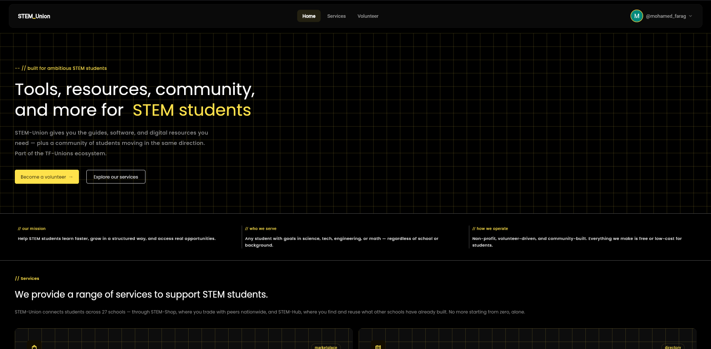
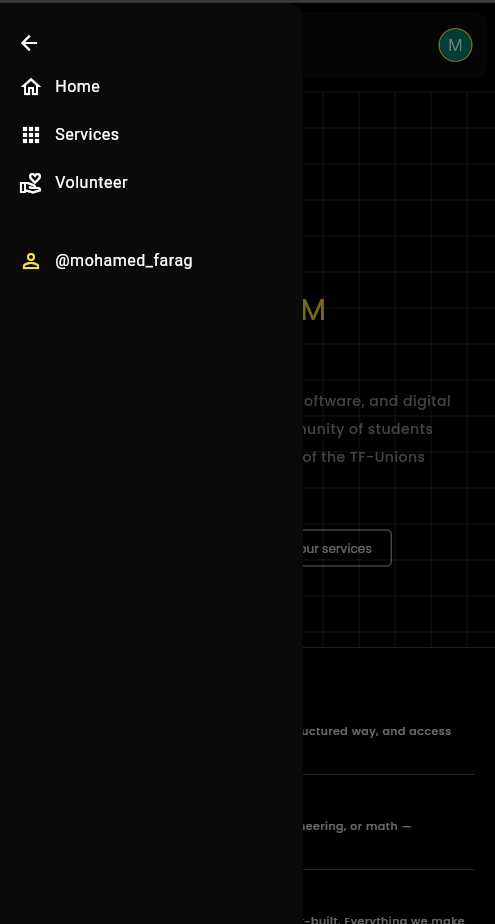
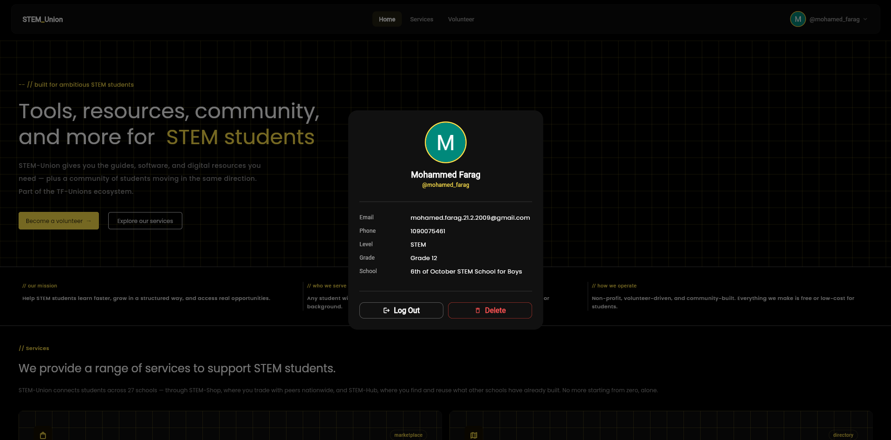

# STEM-Union

A Flutter Web app for STEM-Union — a sub-organization under **TF-Unions** that gives STEM students across 27 schools in Egypt access to shared tools, resources, and a connected community.

> Part of the TF-Unions ecosystem. Users must be logged in via TF-Unions before they can access this app — there is no public-facing signup flow inside STEM-Union itself. you have to be a STEMer to access this website.

---

## What this app does

STEM-Union's main site is a **landing + directory layer**.


### Home page sections



### Mobile drawer (`StemUnionDrawer`)



### Profile dialog (`showProfileDialog`)



---


## Tech stack

- **Flutter Web**
- **GetX** — state management 
- **Firebase Auth** — authentication
- **Cloud Firestore** — user records (`users` collection)

---


## Getting started

```bash
flutter pub get
flutter run -d chrome
```

Requires Firebase project configuration (`firebase_options.dart` / `google-services` setup) and a Cloudinary unsigned upload preset if profile picture upload is reintroduced later.